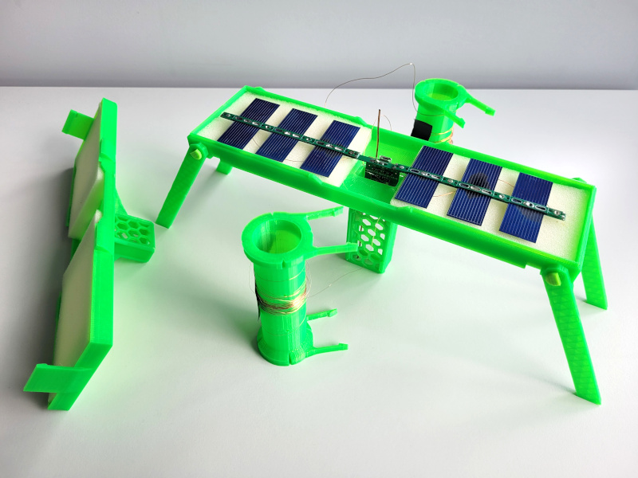
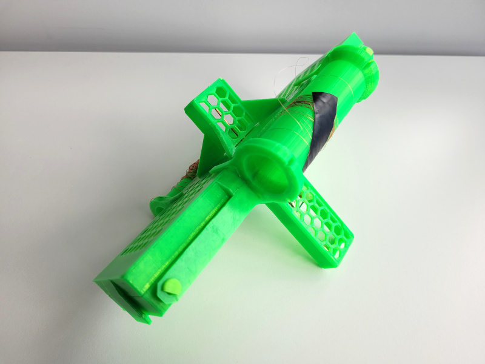
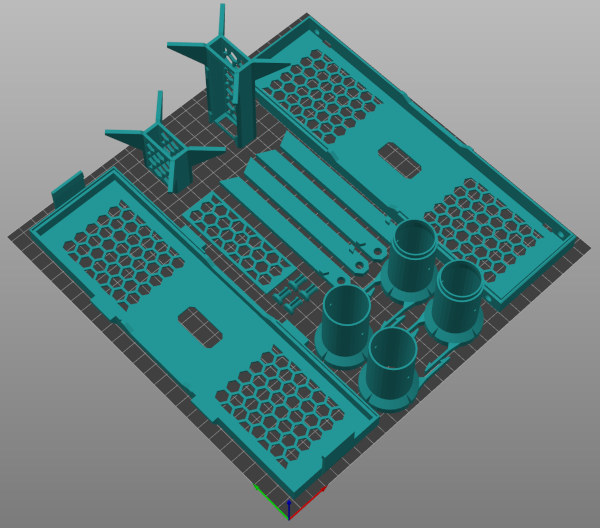

# traquito-case
Transport case for a pico balloon tracker https://traquito.github.io/

All parts are designed to be printed without supports. Only minimal sanding, a bit of CA glue and small sheet of 1cm thick foam is needed for assembly.

Licensed under CC BY-SA 4.0. To view a copy of this license, visit https://creativecommons.org/licenses/by-sa/4.0/

## Instructions
1. Print all parts:
    - bottom.stl
    - top.stl
    - tower.stl
    - tower_door.stl
    - spool_p2.stl **2x**
    - spool_p1.stl **2x**
    - tower_small.stl
    - pin.stl **4x**
    - leg_1.stl **2x**
    - leg_2.stl **2x**

    

2. Secure legs to the case with printed pins. Insert piece of fillament into the pins, it will prevent them from falling out.
3. Glue "towers" to the recessed holes, you may need to sand the interfacing parts in order for them to fit in.
4. Sand the tower door carefully so it can be slid in with not too much force and doesn't fall out.
5. Cut and insert foam into the case, Optionaly use double sided tape or glue to secure it. Small pieces of foam can be used to hold the microcontroller in the tower before it is soldered to the panels.
6. Glue the two parts of the wire spools together.
